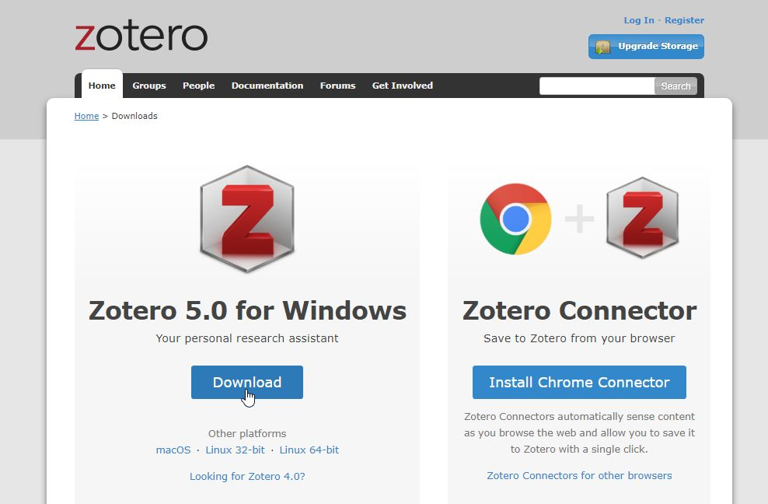
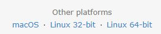
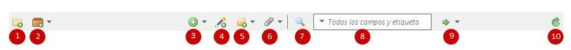

# Zotero: guía básica
## Manual básico del gestor bibliográfico Zotero

Zotero es un gestor de referencias bibliográficas libre, abierto y gratuito, desarrollado por el Center for History and New Media de la George Mason University. Su nombre proviene de la palabra albanesa zotëroj (pronunciado zoh-TAIR-oh), que significa "dominar o adquirir una habilidad en el aprendizaje".

Zotero se compone de una aplicación de escritorio, disponible para Mac, Windows y Linux, que permite gestionar nuestras referencias, y de un conector para los navegadores Chrome, Firefox y Safari, que detecta y captura automáticamente todo tipo de información bibliográfica en la web.

También es posible utilizar Zotero como aplicación en la nube, creándonos una cuenta en [Zotero.org](https://www.zotero.org/). Si sincronizamos nuestro Zotero de escritorio con nuestra cuenta en la web, podremos acceder a nuestras referencias bibliográficas desde cualquier ordenador.

# Instalación de Zotero

La instalación de Zotero es muy sencilla. Sigue estos pasos:

1. Accede a la página web del gestor [Zotero.org](https://www.zotero.org/).
2. Haz clic en el botón de descarga (Download).

La página de descargas detectará automáticamente tu sistema operativo y navegador. Pulsa en Download y descarga e instala Zotero 5.0. Los plugins para Word, Google Docs y Libre Office se instalan automáticamente junto con Zotero en tu ordenador.

Zotero también está disponible para Mac y Linux.

## Instalación de Zotero Connector

Desde la página de descargas, instala el conector para tu navegador.

Un icono de Zotero (una Z o un pequeño rectángulo) se instalará en el lado derecho de la barra de herramientas de tu navegador.

# Interfaz de Zotero

Zotero presenta una interfaz organizada en tres columnas, con la barra de herramientas en la parte superior.

## Columnas

1. **Columna izquierda:** Mi biblioteca, junto con las carpetas que creamos según nuestros proyectos, temas, etc.
2. **Columna central:** Listado de referencias de Mi biblioteca (todas las referencias) o de las distintas carpetas.
3. **Columna derecha:** Información y metadatos de una referencia específica seleccionada en la columna central.

## Barra de herramientas

- Crear carpetas
- Crear grupos y fuentes RSS
- Crear referencias manualmente
- Agregar referencias por identificador
- Agregar notas
- Añadir adjuntos
- Búsqueda rápida
- Búsqueda avanzada
- Localizar en CrossRef, Google Scholar, etc.
- Sincronizar

# Añadir referencias a Zotero

Existen diferentes formas de añadir referencias a Zotero:

* Directamente desde la web, a través de Zotero Connector.
* Añadiendo PDFs y extrayendo sus metadatos.
* Utilizando un número normalizado (ISBN, DOI, PMID, arXiv ID).
* De forma manual.

Aunque la mayor parte de la información bibliográfica que captura Zotero es correcta, siempre es aconsejable revisarla para corregir y/o agregar datos.

## A través de Zotero Connector

Zotero Connector es una extensión que conecta Zotero (debe estar abierto) y nuestro navegador.

Cuando Zotero detecta información bibliográfica en la web, el conector detecta el tipo de elemento (artículo, libro, página web) que está viendo. El conector cambia de la Z a un icono diferente según el tipo de elemento. Al pulsar sobre él, guarda la referencia en nuestra colección. Zotero también puede guardar el texto completo en PDF, si lo encuentra disponible.

Si encuentra varias referencias en la web, el icono se transforma en una carpeta. Al pulsar sobre ella, se abre una ventana para seleccionar aquellas que nos interesen.

## PDFs

Si tenemos en nuestro ordenador PDFs que queramos añadir a Zotero, basta con arrastrarlos y soltarlos en la columna central del gestor. Zotero extraerá automáticamente los metadatos y creará las referencias bibliográficas.

También podemos añadir PDFs haciendo clic en el icono de Adobe PDF cuando veamos los PDFs en nuestro navegador.

## Mediante identificador

Podemos agregar rápidamente referencias a Zotero introduciendo un número normalizado (ISBN, DOI, PMID o arXiv ID). Hacemos clic en el icono de la varita mágica, escribimos el número normalizado y Zotero automáticamente descargará y guardará la referencia bibliográfica.

## A mano

Para incorporar manualmente una referencia a Zotero, hacemos clic en el icono "Nuevo elemento". Seleccionamos el tipo de documento que queremos añadir en el menú desplegable (la lista completa de tipos de elementos se encuentra en "Más"). En la columna de la derecha vamos introduciendo la información bibliográfica.

####

